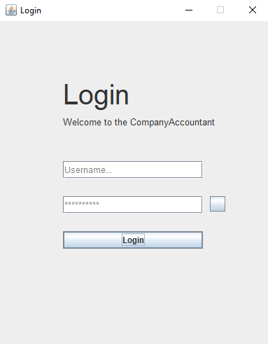
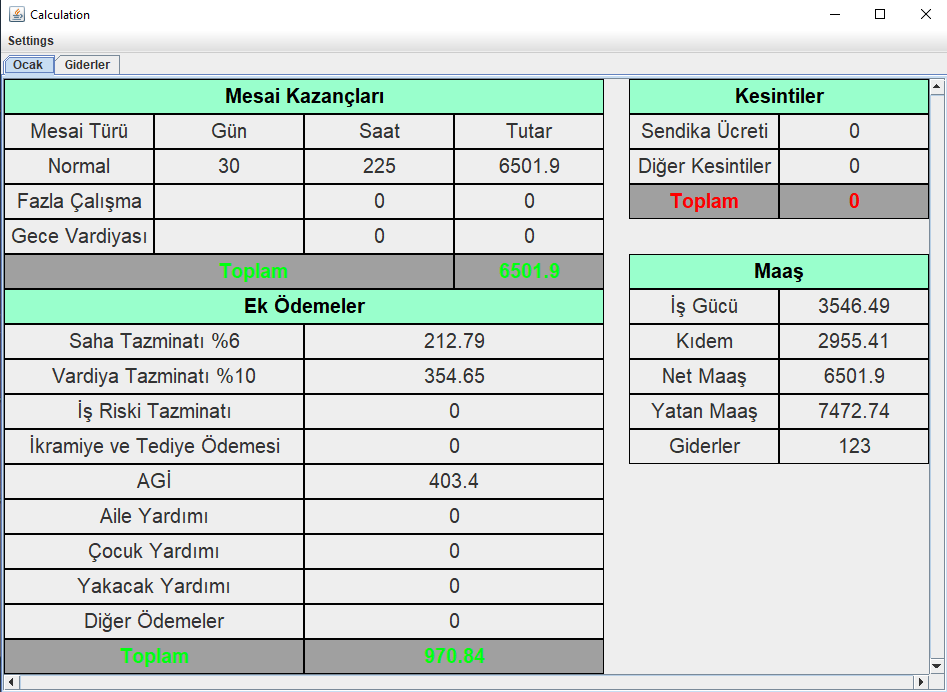
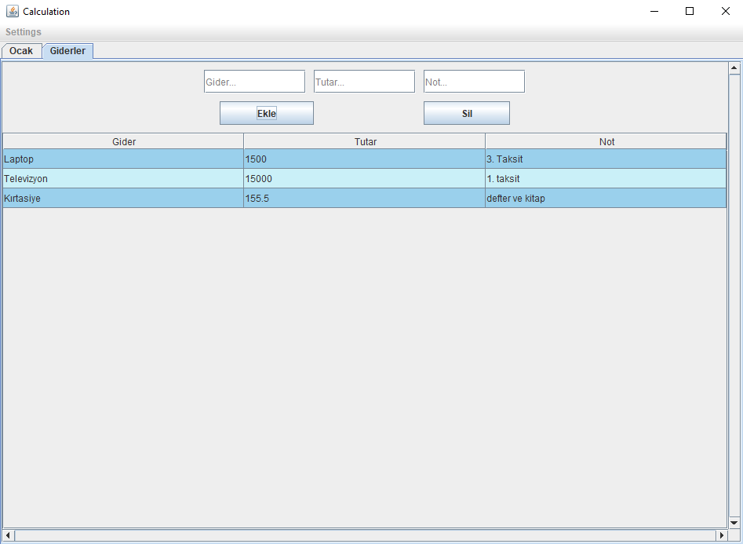
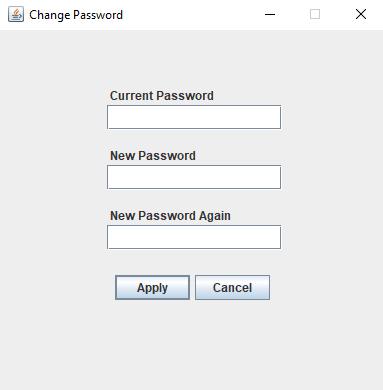

# CompanyAccountant
Hello Folks. This is my coding project. You can use this program if you are in the particular company that I took reference to. I will be going to share my experience when I was creating this project. Enjoy your read.

In this project, I worked with my father. My father came to me and told me that he needs a program to track his salary. I decided to write a Java Swing program to overcome this problem. It took me 3 weeks to build this project. The process was quite nice and instructive. I learned tons of stuff about MySQL, JDBC (Java Database Connection), and Java Swing.

Let's get to the point. What can you see in this program? This program has three main parts. The first one is the Login screen. As the name suggests, this screen takes your username and password to let you go inside. That username and password will be provided by me. Because I don't want everybody to register for this program. Maybe in the future, I can let everybody use this program. Who knows... Secondly, the calculation screen. In this screen, you are going to see with the main part of the program. The screen shows the salary and other kinds of stuff. This screen will change according to the conditions found in the third part. Let's talk about the third part which is having conditions. In this part, clients can arrange their salary by conditions, choose their working features like where they are working or what their jobs are. There are some other kinds of stuff like changing the password screen. This is basic, it changes your password :). See you later.

-Login Screen

-Calculation Screen

-Expenses Screen

-Profile Settings Screen

-Change Password Screen

-Your junior developer Durmus Berk
